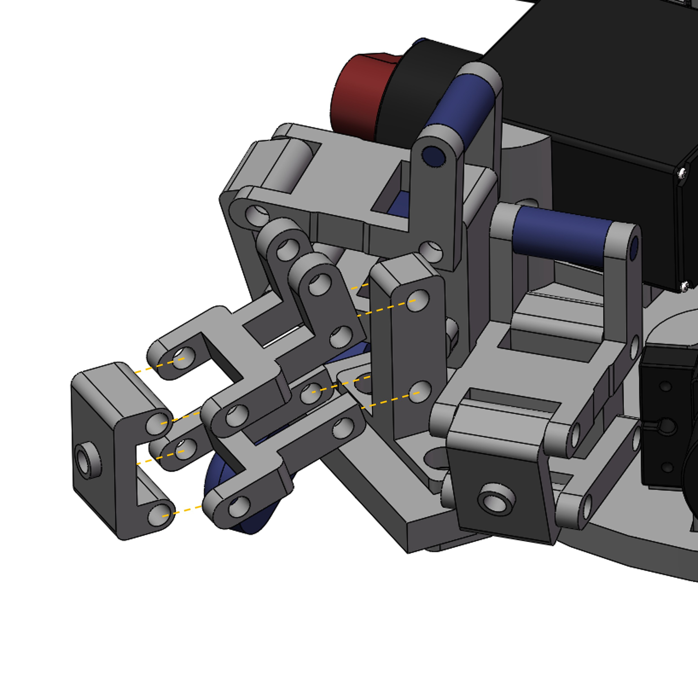
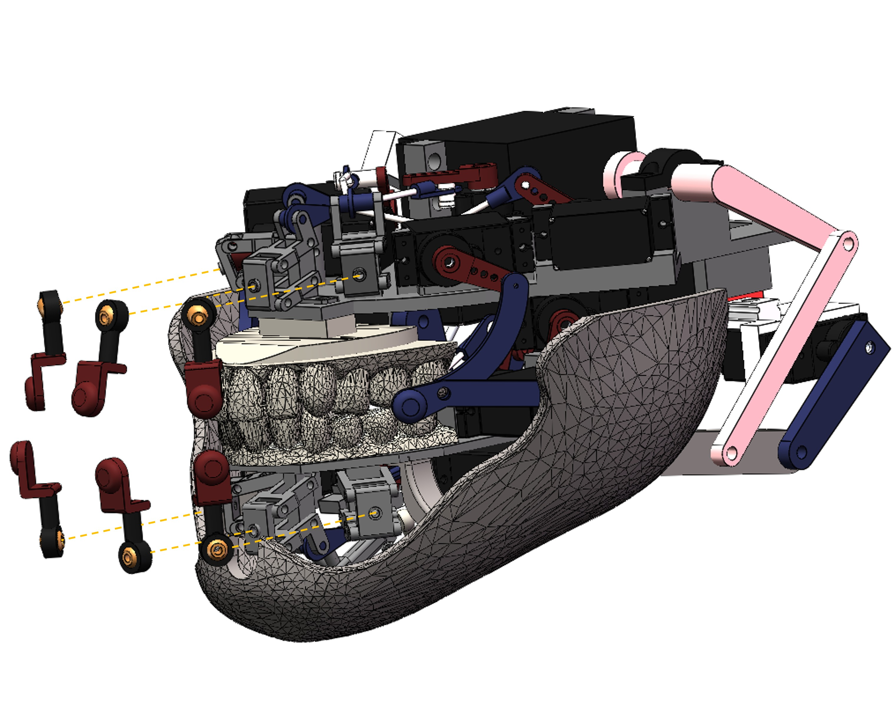
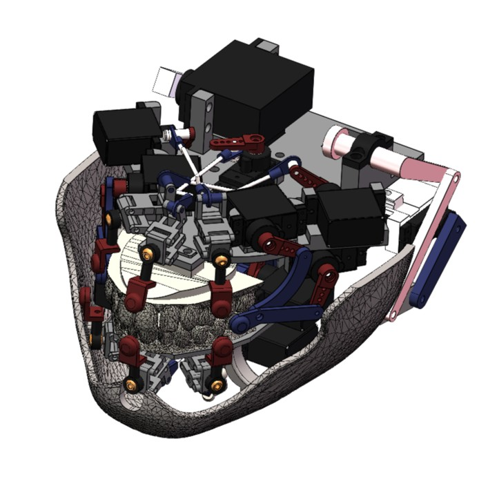

<div align="center">
<h2>Morpheus: A Neural-driven Animatronic Face with<br>
  Hybrid Actuation and Diverse Emotion Control</h2>
<h2>Hardware Design</h2>

**RSS 2025**

**Zongzheng Zhang**<sup>1,2*</sup> · **Jiawen Yang**<sup>1*</sup> · [**Ziqiao Peng**](https://ziqiaopeng.github.io/)<sup>1</sup> ·<br>
**Meng Yang**<sup>4</sup> · [**Jianzhu Ma**](https://majianzhu.com/)<sup>1</sup>, **Lin Cheng**<sup>5</sup> · [**Huazhe Xu**](http://hxu.rocks/)<sup>3</sup> . [**Hang Zhao**](https://hangzhaomit.github.io/)<sup>3</sup> and [**Hao Zhao**](https://sites.google.com/view/fromandto/)<sup>1,2</sup><br>

<sup>1</sup> Institute for AI Industry Research (AIR), Tsinghua University, <sup>2</sup> Beijing Academy of Artificial Intelligence (BAAI),<br>
<sup>3</sup> Institute for Interdisciplinary Information Sciences(IIIS), Tsinghua University, <br>
<sup>4</sup> MGI Tech, Shenzhen, China, <sup>5</sup> Beihang University<br>
<sub>(* indicates equal contribution)</sub><br>
[**RSS official**](https://roboticsconference.org/program/papers/80/) | [**Project Page**](https://jiawenyang-ch.github.io/Morpheus-Hardware-Design/)
</div>
<div align="center">
  
  
</div>

## Catalog
- [CAD model Download](#cAD_model-Download)
- [Bill of Materials](#bill-of-materials)
- [File content](#file-content)
- [Building Instructions](#building-instructions)
- [Silicone Face](#silicon-face)
- [License and Acknowledgements](#license-and-acknowledgements)
- [Citation](#citation)

## CAD model Download
Due to the large size of the CAD model files, they are hosted on Google Drive instead of being uploaded directly to GitHub. You can download the entire CAD model via the following link:

[Download CAD Model Files](https://drive.google.com/drive/folders/1n12V-EUoFsY6ys1dDMhCXVMRPuU5FeQE?usp=drive_link)


Please ensure you have **SolidWorks 2020 or later** installed to open and edit these files.

## Bill of Materials
All costs are listed in USD.
<table>
  <thead>
    <tr>
      <th>Item</th>
      <th>Quantity</th>
      <th>Cost per Item</th>
      <th>Total Cost</th>
      <th>Note</th>
    </tr>
  </thead>
  <tbody>
    <tr>
      <td>Integy RC GuoHua A0090 9g Metal Gear Digital Micro Servo 6kg</td>
      <td>29</td>
      <td>4.06</td>
      <td>117.74</td>
      <td><a href="https://www.amazon.com/Integy-Model-C30371-GuoHua-Digital/dp/B09CXFTQD5">Purchase Link</a></td>
    </tr>
    <tr>
      <td>RC Spare Part Compatible with KS3518 Rc Car Waterproof Metal Digital Servo High Torque Mechanical Arm Hand Metal Servo Motor</td>
      <td>4</td>
      <td>59.35</td>
      <td>237.4</td>
      <td><a href="https://www.amazon.com/Compatible-KS3518-Waterproof-Digital-Mechanical/dp/B0F5M32RWP/ref=sr_1_1?crid=1ZYFWMTZ673IX&dib=eyJ2IjoiMSJ9.-IVdW-9xaY5TRunRA-fOByCKFwmgexoFSscOU4XObak_OgGp7tPTxuHn8rTex6RdVW8ZzTqmt-93lmZKtKbQbg.OwY5YXJU8kzRU_SVa4rOSpwvaStMnNZica_KsrZkigQ&dib_tag=se&keywords=KS3518&qid=1746275568&sprefix=ks3518%2Caps%2C524&sr=8-1">Purchase Link</a></td>
    </tr>
    <tr>
      <td>10pcs 3-Pin 30cm Servo Extension Cable Cord Female to Male Lead Wire Connector JR for RC Car Airplanes Remote Control-30mm</td>
      <td>33</td>
      <td>7.99</td>
      <td>263.67</td>
      <td><a href="https://www.amazon.com/ACEIRMC-Extension-Connector-Airplanes-Control/dp/B0CQ4QKDF4/ref=sr_1_1?crid=3J3MP55GZNXLH&dib=eyJ2IjoiMSJ9.dJ_7icrl7y_zcruG1rNP4gqMaCfjh7ZtjSwXCe8N0OHYAU6RNconHDlLu6u522g7KnUTjhK2TPnz88rJc0_sPFffWlyGiBy5AzQJzvl6NPlW11uXoEdy47y66cfeZ5t5s2S1Y0jxeK_MCJawDdH71p8KJL639Gn7mTsfxt8Wqg8Xl4gZNXHwW9nznBM8SVITe45HqTYbllLpcY2Yv7PvEXAgQFDjfKzjzrL2GThyj0qEqy6UsxdYl_-s_Gz_DE7APEpsvnYgLSLngVwKopAfBFNPWn0Efgr-5bIizl3B5Vk.Cf0EkTrjzDuOPsP6g5Z1neA-BpsSIktmKU1wx2UKClY&dib_tag=se&keywords=10pcs%2B3-Pin%2B30cm%2BServo%2BExtension%2BCable%2BCord%2BFemale%2Bto%2BMale%2BLead%2BWire%2BConnector%2BJR%2Bfor%2BRC%2BCar%2BAirplanes%2BRemote%2BControl&qid=1746276797&sprefix=10pcs%2B3-pin%2B30cm%2Bservo%2Bextension%2Bcable%2Bcord%2Bfemale%2Bto%2Bmale%2Blead%2Bwire%2Bconnector%2Bjr%2Bfor%2Brc%2Bcar%2Bairplanes%2Bremote%2Bcontrol%2Caps%2C1007&sr=8-1&th=1">Purchase Link</a></td>
    </tr>
    <tr>
      <td>550PCS M3 Screw Kit</td>
      <td>4</td>
      <td>9.99</td>
      <td>39.96</td>
      <td><a href="https://www.amazon.com/Bemaka-550PCS-Washers-Assortment-Stainless/dp/B0D5CSSYGH/ref=sr_1_3?crid=3I297HCT5TOLQ&dib=eyJ2IjoiMSJ9.okmcfd6HyVTJIzNKNtB4FzL5gUiqx03RpjxbclyBtirWbdz31U-Z-v3emuozcGUyQDJRwp0pTkhCtpuRK8fNdjtT8qIjdSXJpyGl9snh0MtOGcIQ5Oyw5SdlZA_NJ3HUDntG66DobARBKUCOT_2a-YezcjxMEXg5pVeVdZmy71fjnJZHLODOjJkWR8oY4jG6iH3bhGh464G9uo_7DKZzt5LXcCVtQgG4aXnVEjOVzko.pzqDIS308TxAJsvm6v4tA4x-2eJg8bWnyruLxR_KITo&dib_tag=se&keywords=stainless%2Bsteel%2BM3%2Bscrew%2Band%2Bnut%2Bset&qid=1746276660&sprefix=stainless%2Bsteel%2Bm%2Bscrew%2Band%2Bnut%2Bset%2Caps%2C1258&sr=8-3&th=1">Purchase Link</a></td>
    </tr>
    <tr>
      <td>M3 11.8Inch Pushrod Connector 304 Stainless Steel Rod Linkage for RC Model Airplane Helicopter Boat Car DIY Parts 12Pcs</td>
      <td>4</td>
      <td>7.98</td>
      <td>31.92</td>
      <td><a href="https://www.amazon.com/11-8Inch-Connector-Stainless-Airplane-Helicopter/dp/B0BGQZK6HK/ref=sr_1_23?crid=QHSI5URBI5JS&dib=eyJ2IjoiMSJ9.-ax7qPa1otcitqggRyWXTn02V6ZPnFc4uqnrqz9O4VZgzbX7-5i4P50RrUKAmow5y1Qh6wpUXeQsCUiv9W3dFm3cRL3Scp-A8RJLKOf8uj_sXItyp1Fy-4dMFJIoM04ByhcYcR_R_fEx6FSSV1IdSSeXZkIN2gzhUIfa1HHuOFgY_3IFONvTkeuuSYr0DrNXi-RsjN3WkNp7M7kqG-9SM7IBglgPWzRfoQJpWobHB6kYZEFKoz9Aw3QuSSBmYY56v8raTvlF_8RSwhty4TbdilMAflaR52zxv0_t8wsg9Fk.MvZ9FppJ4VbCLlSVitCV5iMmOueTRuOlBq1PQqXHzXY&dib_tag=se&keywords=RC%2Bpush%2Brod&qid=1746278638&sprefix=crank%2Bairplane%2Bmodel%2Caps%2C1709&sr=8-23&th=1">Purchase Link</a></td>
    </tr>
    <tr>
      <td>5/10sets M2 304 Stainless Steel Leather Bag Belt Photo Scrapbook Album Book Post Binding Screw Screw Rivet Metal Screws</td>
      <td>20</td>
      <td>9.66</td>
      <td>193.2</td>
      <td><a href="https://www.amazon.com/YUYUDEHM-Chicago-Assorted-Leather-Bookbinding/dp/B0DGQ5NVW1/ref=sr_1_9?dib=eyJ2IjoiMSJ9.ZDvYCDAXBtBG62ejiAiW4CSjnaCi47Efiv74bibLvAGWfklFwSQQNO1lJrHdHRzRFVCNKgixY3H6o-thvzC2QJCjAChTnKG0-2ZyknDj5FJI-i8tc-juCEpiSnFkbStU4_J-bnksKkSAzQgXSI8CS-W3l_0b48PjTAFTPAfXXpCjPTaxpyG0QFpXXRXQosJ2IWdm5BBuPTt-tiAtHnSfZvuucMJWnI3xHyOHhvsyY0ohFOICZ06IaDj2D4QQUZ2KWgT36kE0EwS4BMqYirFLt3U2-Va3jOT5o7Dmg0BVtsE.IxfmGw4SWixguE2wyZIVGLhj1tulG1hFzF81ZhWF4_0&dib_tag=se&keywords=Screws%2BM3&qid=1746944275&s=industrial&sr=1-9&th=1">Purchase Link</a></td>
    <tr>
      <td>12Pack Vgoohobby Metal M3 Tie Rod End Ball Holder RC Joint Link Ball Head Holder CW Compatible with HSP Traxxas HPI Axial Redcat Racing 1/10 RC Car Truck Buggy Crawler</td>
      <td>6</td>
      <td>12.99</td>
      <td>77.94</td>
      <td><a href="https://www.amazon.com/12Pack-Vgoohobby-Compatible-Traxxas-Crawler/dp/B0BHF2WG1V/ref=sr_1_11?crid=3F0VT81HKNKS&dib=eyJ2IjoiMSJ9.FDixr-qtQ5yan8wKBDNU25c-rp8eoXI1J5Y9aHt3uHUxyAku9Ogeyop--tCKbTuIIB1h1Eismgek2ZB34CF-LFqRFbgw-teF4vWrD0rIIwvqFbVn6lYMMvuJs4dmnZBxmOaUd97DGwwV56ivxqRoRwAZE-VDN0UDg681w2_MPANQhWp7k6Pn7FG94LlLoz_9-LuahFjpX04lNLODzHiDocP0Pt0rV-8CT5spHCeXzdARI5235U4CCVsFNAwFOuw3TgirptzZtY4leVxO7eH02xzUEvWyvw84XRSH80EM8Nk.rhLFGqMgsKmj6L7c5Hk9TCrqHOGdF4SqDOpC-iC4KTE&dib_tag=se&keywords=Metal%2Bball%2Bjoint%2Bfor%2BRC%2BM3&qid=1746278887&sprefix=metal%2Bball%2Bjoint%2Bfor%2Brc%2Bm%2Caps%2C329&sr=8-11&th=1">Purchase Link</a></td>
    </tr>
    <tr>
      <td>2Pcs Aluminum 1.75inch 25T Servo Arm Horn Long Steering Servo Arms Compatible Futaba Savox Xcore HL HSP HD Power Rc Servos for RC Airplanes RC Plane Crawler Car</td>
      <td>1</td>
      <td>9.99</td>
      <td>9.94</td>
      <td><a href="https://www.amazon.com/Aluminum-1-75inch-Steering-Compatible-Airplanes/dp/B0DZBCJXHX/ref=sr_1_52?crid=22FJW0YBT3YP4&dib=eyJ2IjoiMSJ9.nex6y2yjHVzNrl6QWyqAYallrvhJ0i4Upt7ABIsfqShCmJsPhEldmvjHHC3p3nhEO-u8utXmcxlCU5TBeY3D0qJRY0WPv44boGc06TEDDevrc9AwG2vUrjac_1805H-XajHR0S6XbohvKm8oB7PRW1yyN5Hel0c_bv652NT-nhHmHD7HnkM-j4Q7wrFihaVN1yV7J0Q7zYutAcy0ej7d57iJrMWlyIbuSac-SBp7CMFEvSAvgOv3EYPJYovlsOZo7rnRv5EuhQd2WdgvdOqCzELjqantkhytHI9fYZVVMHE.PVa3y4pS-bk8jEkTq79KRGR_6gWNALptLhz882MvFXI&dib_tag=se&keywords=servo+horn&qid=1746279895&sprefix=servo+horn%2Caps%2C551&sr=8-52&xpid=XCDWzGkVARhOL">Purchase Link</a></td>
    </tr>
    <tr>
      <td>LML9B 9mm Linear Rail Mini Bearing Steel Rail Slide Rail+ Slide Block Variety Length (55mm)</td>
      <td>1</td>
      <td>11.62</td>
      <td>11.62</td>
      <td><a href="https://www.amazon.com/LML9B-Linear-Bearing-Variety-Length/dp/B07GQJ9LT8/ref=sr_1_12?crid=804HQ21AODZT&dib=eyJ2IjoiMSJ9.foaXoMw6H5aSAHuAc3I05Gomy1DhK-38uVVcDNK5bKmTiyFzn1Ff8bN-tKUk89-djt9jBWOCWPLdAJfPDpdAPFE-WHic3GX_hE15nVDPFR6zD-hZ_OfICvt5HRrLurJZqimZRHha70iDfwrQs0ShER6G3qhaQ3J33dob77S5wP0ynfFH8FnKyLlBL07JV-cT8YX-IKxQuVh3lJ_tLrJgoDx--kWGOuX14spGZAnVFrbKDO_m8dd2lTSyBGAO7VdoNB3C6fXyB78Lpmzyp_T1jJWmRRkV1b-AcjrPzkzWlkM.gwRljWHHN36jk2AiX2FFvgCjfGXUQA7ahTD421FLH1M&dib_tag=se&keywords=slider%2Band%2Brail&qid=1746280266&sprefix=slider%2Band%2Brail%2Caps%2C489&sr=8-12&th=1">Purchase Link</a></td>
    </tr>
    <tr>
      <td>7pcs Realistic Fake Tongue, Magic Tricks Accessories, Halloween Pranking False Tongue Horrific Tongue Prop Tricks Tongue Toys (009)</td>
      <td>1</td>
      <td>8.55</td>
      <td>8.55</td>
      <td><a href="https://www.amazon.com/Realistic-Accessories-Halloween-Pranking-Horrific/dp/B096V99JD5/ref=sr_1_1?crid=3140KQ841179A&dib=eyJ2IjoiMSJ9.3ndHWgEOrgCivdItMQ0-QIEL4AlDGgxiD35ca00FekXP5fYhPSH5zlyIQs-O7KuSXxLmNWAjtQNnHGf4q-cPzvWEgy3vvHSDanxC01IV9r1BHC1y-0kjmeNen1iDk3DM2T3yetF5TPk5l6efMv44qb7qUGCZPva_63vq4apfYXekJC2RA2Szv0owWTWaPXw8BCOwj4zkqEOGcge86ad27naSHq0YSe97fhwAqaIWX8afwGEwhk-EIgq248ELp2qYAS9Afwm_LmBG9aHkqPCgwNRjsq6MqGV_mHSJy1qjVDY.qo0brqmLdoasSz-9Sf0rFuapySzLbTl0wmHeHNQ1p1k&dib_tag=se&keywords=fake+tongue+prank&qid=1746280431&sprefix=fake+tongue+prink%2Caps%2C303&sr=8-1">Purchase Link</a></td>
    </tr>
    <tr>
      <td>2 Pcs 8mm to 8mm Universal Joint Shaft Coupling with Screws for Motor</td>
      <td>1</td>
      <td>11.99</td>
      <td>11.99</td>
      <td><a href="https://www.amazon.com/Befenybay-Universal-Joint-Coupling-Screws/dp/B07V9NTQLH/ref=sr_1_3?crid=1NG4AYO30X8CT&dib=eyJ2IjoiMSJ9.pRH26F92Lz3OeVdv1pTKc72IUOBnlLi4y21j7uUs7LypfLJ90N8WLf1Pr33N9hjNsJ1W_2myh17gl-EuCV0swDw-iJiFZEv0W5Bxj6aqzEum0yF1xVbMhsa3Z7IaUtkFFxOVVoefyB4hCVK-PzlW7KJBSIk-vG_eGl8gzoszEUF9o4m1ZV7FCLi8xMFF2vc9FFhhNJMN-Yg4br5xB9kkTL2hpzrcFx0euPu1Z6ozfyY.j9WG9eSVNjJDOA6ud6LEEr7T4gzbBn151i9CCdP9FP0&dib_tag=se&keywords=universal%2Bjoint&qid=1746453918&sprefix=universal%2Bjoint%2Caps%2C530&sr=8-3&th=1">Purchase Link</a></td>
    </tr>
    </tr>
    <tr>
      <td>CanaKit Raspberry Pi 5 Starter Kit PRO - Turbine Black (128GB Edition) (8GB RAM)</td>
      <td>1</td>
      <td>159.99</td>
      <td>159.99</td>
      <td><a href="https://www.amazon.com/CanaKit-Raspberry-Starter-Kit-PRO/dp/B0CRSNCJ6Y/ref=sr_1_1?dib=eyJ2IjoiMSJ9.jcr0uFX19Ti6vPMuNfXSxuom6fh6jvUMt7rRFszG8OdJB1LHo1ODQ7CAiY1I_y6YeZaZHmsy7T4M5z4SXgmhqwWn5cDkcCfzLgZ4xUnrgd4TO46VwbRwKqCOQ-KQzW3ufLRwgDWO4iT1k_NZcFOsNtwjXyRIcVJKgPn0DyAYUUNwefbayiV8Ak6qmwg8rkxxZN0Fe5xiKFNsUKUjPLuaCuZas-qt84gYpYO3Pm9g_kE.oT2WEk3zMAoRVuCWt9_205RuwKwwBTFkY90uJTxfCOo&dib_tag=se&keywords=Raspberry%2BPi%2B6&qid=1746793704&sr=8-1&th=1">Purchase Link</a></td>
    </tr>
    <tr>
      <td colspan="3"><b>Total</b></td>
      <td colspan="2"><b>1595.1</b></td>
    </tr>
  </tbody>
</table>

## File content
**Note: This model is compatible with SolidWorks 2020 and later versions.**
```plaintext
CAD_model
├── full_assembly.SLDASM
├── cheek_face_slave_part_mirror.SLDPRT
├── cheek_facial_slave_part_mirror.SLDPRT
├── cheek_line.SLDPRT
├── ks3518.SLDPRT
├── L.SLDPRT
├── nose_line.SLDPRT
├── nose_mirror_line.SLDPRT
├── nose_mirror_slave_part.SLDPRT
├── nose_slave_part.SLDPRT
├── OT.SLDPRT
├── OT_mirror.SLDPRT
├── Raspberry_Pi_(computer_science).SLDPRT
├── shell_back_of_the_head.SLDPRT
├── shell_carapace.SLDPRT
├── shell_Face_Bone_Connectors.SLDPRT
├── shell_Face_Bone_Connectors_mirror.SLDPRT
├── shell_facial_bones.SLDPRT
├── shell_left_ears.SLDPRT
├── shell_right_ears.SLDPRT
├── shell_skin_face.SLDPRT
├── studs.SLDPRT
├── studs_60.SLDPRT
├── "eye"
│   ├── eye.SLDASM
│   ├── eye_Balls_for_head_pulls.SLDPRT
│   ├── eye_bassinet.SLDPRT
│   ├── eye_comb.SLDPRT
│   ├── eye_crank_handle.SLDPRT
│   ├── eye_Eyeball_mounts.SLDPRT
│   └── eye_Eyelid_mounting_stubs.SLDPRT
│   ├── eye_lower_eyelid_of_the_right_eye.SLDPRT
│   ├── eye_lower_eyelid_of_the_right_eye_mirror.SLDPRT
│   ├── eye_m_shaped_board.SLDPRT
│   ├── eye_mounted_version.SLDPRT
│   ├── eye_pupil.SLDPRT
│   ├── eye_Shanks_for_Ball_Tie_Rods.SLDPRT
│   ├── eye_upper_eyelid_of_the_right_eye.SLDPRT
│   ├── eye_upper_eyelid_of_the_right_eye_mirror.SLDPRT
│   ├── eye_y_connector.SLDPRT
├── "eyebrow"
│   ├── EYEBROW.SLDASM
│   ├── eyebrow_brow center motor mounting bracket.SLDPRT
│   ├── eyebrow_brow center pendulum.SLDPRT
│   ├── eyebrow_connected model aircraft regulator.SLDPRT
│   ├── eyebrow_crank v4.SLDPRT
│   ├── eyebrow_eyebrow peak rocker 1.SLDPRT
│   ├── eyebrow_eyebrow peak rocker.SLDPRT
│   ├── eyebrow_GUOHUAA0090.SLDPRT
│   ├── eyebrow_Installation platform.SLDPRT
│   ├── eyebrow_mirror brow center motor mounting bracket.SLDPRT
│   ├── eyebrow_mirror brow center pendulum.SLDPRT
│   ├── eyebrow_mirror eyebrow peak rocker 1.SLDPRT
│   ├── eyebrow_short brow joystick.SLDPRT
├── "mouth"
│   ├── mouth assembly.SLDASM
│   ├── mouth_aluminum rocker arm.SLDPRT
│   ├── mouth_ball of spherical hinge.SLDPRT
│   ├── mouth_baseplate for teeth.SLDPRT
│   ├── mouth_baseplate.SLDPRT
│   ├── mouth_bearing cap.SLDPRT
│   ├── mouth_connector for OT head.SLDPRT
│   ├── mouth_connector for OT head_4mm medium.SLDPRT
│   ├── mouth_connector for OT head_4mmlong.SLDPRT
│   ├── mouth_convex iron wire.SLDPRT
│   ├── mouth_crank.SLDPRT
│   ├── mouth_fourth-generation jaw.SLDPRT
│   ├── mouth_gear.SLDPRT
│   ├── mouth_GUOHUAA0090.SLDPRT
│   ├── mouth_iron wire 30mm.SLDPRT
│   ├── mouth_iron wire_below middle.SLDPRT
│   ├── mouth_iron wire_freedom20mm.SLDPRT
│   ├── mouth_iron wire_freedom30mm.SLDPRT
│   ├── mouth_iron wire_upper middle.SLDPRT
│   ├── mouth_jaw five-bar mechanism_long.SLDPRT
│   ├── mouth_jaw five-bar mechanism_short.SLDPRT
│   ├── mouth_ks3518.SLDPRT
│   ├── mouth_lip connecting rod.SLDPRT
│   ├── mouth_lip six-bar mechanism_4mm crossbar.SLDPRT
│   ├── mouth_lip six-bar mechanism_8mm crossbar.SLDPRT
│   ├── mouth_lower teeth.SLDPRT
│   ├── mouth_metal ball of spherical hinge.SLDPRT
│   ├── mouth_MG90S.SLDPRT
│   ├── mouth_MGN7C_slider.SLDPRT
│   ├── mouth_MGR7_slider rail.SLDPRT
│   ├── mouth_mirror_motor mounting platform for smiling six-bar mechanism.SLDPRT
│   ├── mouth_mirror_oblique crank extension rod.SLDPRT
│   ├── mouth_mirror_smiling five-bar mechanism_below.SLDPRT
│   ├── mouth_motor mounting platform for smiling six-bar mechanism.SLDPRT
│   ├── mouth_mounting platform for upper lip connecting rod.SLDPRT
│   ├── mouth_oblique crank extension rod.SLDPRT
│   ├── mouth_OT head.SLDPRT
│   ├── mouth_perforated crank.SLDPRT
│   ├── mouth_rack.SLDPRT
│   ├── mouth_self-made ball hinge rod for the lower teeth.SLDPRT
│   ├── mouth_shaft flange.SLDPRT
│   ├── mouth_six-bar mechanism_above_short.SLDPRT
│   ├── mouth_six-bar mechanism_below_short.SLDPRT
│   ├── mouth_six-bar mechanism_with spherical hinge.SLDPRT
│   ├── mouth_slide rail mounting plate.SLDPRT
│   ├── mouth_smiling five-bar mechanism_above.SLDPRT
│   ├── mouth_smiling five-bar mechanism_below.SLDPRT
│   ├── mouth_smiling six-bar mechanism_above.SLDPRT
│   ├── mouth_smiling six-bar mechanism_below.SLDPRT
│   ├── mouth_spherical hinge.SLDPRT
│   ├── mouth_threaded pin.SLDPRT
│   ├── mouth_threaded rod of spherical hinge.SLDPRT
│   ├── mouth_tongue connecting rod.SLDPRT
│   ├── mouth_tongue connecting rod_long.SLDPRT
│   ├── mouth_tongue pulling rod.SLDPRT
│   ├── mouth_tongue tray.SLDPRT
│   ├── mouth_upper lip connection point.SLDPRT
│   ├── mouth_upper teeth.SLDPRT
└── "neck"
    ├── neck.SLDASM
    ├── neck_Axis_positioning_tools.SLDPRT
    ├── neck_ball.SLDPRT
    ├── neck_ball_hinge.SLDPRT
    ├── neck_crosshairs.SLDPRT
    ├── neck_extension_arm.SLDPRT
    ├── neck_Installation_of_sheet_metal.SLDPRT
    ├── neck_Parallel_platforms.SLDPRT
    ├── neck_pole.SLDPRT
    ├── neck_principal_axis.SLDPRT
    ├── neck_transition_part.SLDPRT
    ├── neck_universal_joint.SLDPRT
    ├── neck_Upper_shaft.SLDPRT
    └── neck_y_axis_platform.SLDPRT
```


## Building Instructions


### Screw guide

- **Screw A**: M2.5 × 8 mm (Self-tapping) 
- **Screw B**: M3 × 10 mm (Self-tapping) 
- **Screw C**: &#8960;3 (mating screw)  
- **Screw D**: M3  
- **Screw E**: M2 × 10 mm  


### Neck module
The *neck_Installation_of_sheet_metal* is installed on the *neck_y_axis_platform* using 4 pairs of screws.


Two *ks3518* servo motors are installed on the *neck_Installation_of_sheet_metal* on both sides.


The *neck_extension_arm* is installed on each *ks3518* servo motor to deliver power.


The *neck_principal_axis* is a section of plain shaft which stands on the *neck_Installation_of_sheet_metal*.


Two *neck_Axis_positioning_tools* are deployed to fix the *neck_principal_axis*.


The universal joint is assembled on the upper end of the shaft.


The *neck_Parallel_platforms* is attached with the universal joint with the *neck_Upper_shaft*. 


Two rod linkages connect the *neck_Parallel_platforms* and the *neck_extension_arm*s.


The neck module is completed.


### Eye module

A Guohua servo motor is installed in the middle of the *eye_mounted_version* to control the eyeballs to look vertically. In addition, every servo motor matches a default crank. Therefore, in the following context, servo motor indicates a servo motor and a matching crank if not specified.


Another Guohua servo motor is install on the *eye_bassinet*, which is then intalled between the eyeballs on the *eye_mounted_version*.


A part called *eye_comb* figuratively is fixed on the *eye_bassinet*. An M-shaped part: *eye_m_shaped_board* is fixed on the crank of the servo. Two Y-shaped parts: *eye_y_connector* connect the two parts mentioned above, forming two identical four-bar mechanisms.


The *eye_Eyeball_mounts* are fixed on the *eye_y_connector*. The micro cameras are fixed on them.


The shell of the eyeballs is mounted on the *eye_Eyeball_mounts*.


A L-shaped crank connects the crank of the servo motor and the *eye_bassinet*, forming a new four-bar mechanism.


The four eyelids are then assenmbled around the eyeball.


Four servo motors controlling the eyelids are mounted on the *eye_mounted_version*.


The *eye_upper_eyelid_of_the_right_eye* and *eye_upper_eyelid_of_the_left_eye* are driven by two rod linkages.


Ditto for the lower eyelids.


The eye module is completed.


### Eyebrow module

The two *eye_brow_center_motor_mounting_brackets* are mirror-symmetric which servo motors, *eyebrow_brow_center_pendelums*, and *eyebrow_short_brow_joysticks* are install on. The crank of the servo motor, the *eyebrow_short_brow_joysticks* (rod), and *eyebrow_brow_center_pendelums* (rocker) constitutes a four-bar mechanism.


The two *eye_brow_center_motor_mounting_brackets* are installed on the *eyebrow_Installation_platform*.


Six servo motors are installed on the back of the *eyebrow_Installation_platform* staggeredly.


The *eyebrow_eyebrow_peak_rockers* are installed on the side.


Another rod along with the crank of the servo motor installed at the bottom forms another four-bar mechanism.


The eyebrow module is complete.


### Mouth module

Two *mouth_motor_mounting_platform_for_smiling_six-bar_mechanisms* are installed on the *mouth_baseplate*.


Two rods and two servo motors form the five-bar mechanism. And the latter are installed on the *mouth_motor_mounting_platform_for_smiling_six-bar_mechanisms*.


Three servo motors are then installed on the *mouth_baseplate* to control the upper lips.


At the front of the *mouth_baseplate*, there are two mounting structures，which is used to install the three of the six rods of the six-bar mechanism used to control the lips.


An addtional mounting part is installed in the middle.


This part has the same funciton as the mounting structure.



Then, three adaptively deformed iron wires are used to connect the crank to the rods.


One servo motor is installed from the bottom up, with a gear between the motor and the crank.


For the *mouth_slide_rail_mounting_plate*, a MGR7 slider rail is installed on it.


Two servo motors are installed on the side to control the motion of the jaw opening and closing.


The matching slider is installed on the bottom of *mouth_motor_mounting_platform_for_smiling_six-bar_mechanisms*.


Two servo motors are installed next to the aforemetioned motor.


The *mouth_tongue_connecting_rod_long* and *mouth_perforated_crank* with their matching motor and crank form a four-bar mechanism. The *mouth_tongue_connecting_rod* and *mouth_tongue_pulling_rod* with their matching motor and crank form another four-bar mechanism. Two four-bar mechanisms are connected in parallel.


On the *mouth_baseplate_for_teeth* are the three servo motors controlling the lower lip.


The mechanism at the front is the same as that of the upper lip.


Two *mouth_oblique_crank_extension_rods* are fixed on the cranks on both sides. At the end of that extension rods are the *mouth_threaded_pin* used to install *mouth_metal_ball_of_spherical_hinges*.


Different from the upper lip, another *mouth_threaded_pin* with ball of spherical hinge is install on the *mouth_six-bar_mechanism_with_spherical_hinge*.


One rod with ball hinge on both sides connects the *mouth_six-bar_mechanism_with_spherical_hinge* and the extended rod.


The *mouth_baseplate_for_teeth* is fixed on the jaw.


The lower teeth is then installed on the jaw.


The upper teeth is installed on the bottom of the *mouth_baseplate*.


The *mouth_shaft_flange* is placed on the half-hole of the *mouth_baseplate*. The cap is installed on the half-hole to locate the shaft. A crank of 32mm is connected with the motor on the *mouth_slide_rail_mounting_plate*, and the other end connected with jaw. A long rod connects the *mouth_shaft_flange* and jaw, forming a five-bar mechanism.


On the other side of the jaw, a large servo motor ks3518 is installed on the *mouth_baseplate*, whose matching crank is 38mm long.


A rod connects the longer crank and the jaw. 


To give more freedom around the control points on the lip, spherical hinges are used.



The mouth module is complete.



### Modules' assembly

A *neck_transition_part* is used to connect the neck module and the mouth module.


Four studs of 60mm are used as the connector.


Four studs of 30mm are used as the connector between the mouth module and the eye module.


Three studs of 60mm are used as the connector between the eye module and the eyebrow module.


*Shell_Face_Bones* are used to connect the eye module and facial mask.


The ears are connected with the facial mask. The back of the head is located by two ears. 


The skull is then mounted on the back of the head.


The lines go through the holes designed on the eye and eyebrow module.


## Silicon Face
To optimize expression accuracy and realism, especially in tendon-driven regions, we carefully tested silicone materials. We used A00-30 silicone, known for its skin-like softness, and adopted a 3D-printed mold solution for efficient iteration. The silicone was mixed (1:1 ratio), degassed in a vacuum chamber (-0.1 MPa, 5-10 min), poured into the mold, and cured at 25°C for 4-8 hours, followed by a 24-hour resting period to enhance performance. Material tension was adjusted by thickness (2mm, 2.5mm, 4mm, 5mm), with the eye area thinned to 2mm to prevent localized buildup at the eyelid. For tendon-driven sections, xperiments determined that 4mm skin provided the best balance between visibility and actuation capability.


## License and Acknowledgements
This source code is licensed under the Apache 2.0 liscence found in the LICENSE file in the root directory of this repository.


## Citation
If you find this project useful, feel free to cite our work!
<div style="display:flex;">
<div>

```bibtex
@article{Morpheus,
  title={Morpheus: A Neural-driven Animatronic Face with Hybrid Actuation and Diverse Emotion Control},
  author={Zongzheng Zhang and Jiawen Yang and Ziqiao Peng and Meng Yang and Jianzhu Ma and Lin Cheng and Huazhe Xu and Hang Zhao and Hao Zhao},
  journal={Robotics: Science and Systems (RSS)},
  year={2025}
}
```
